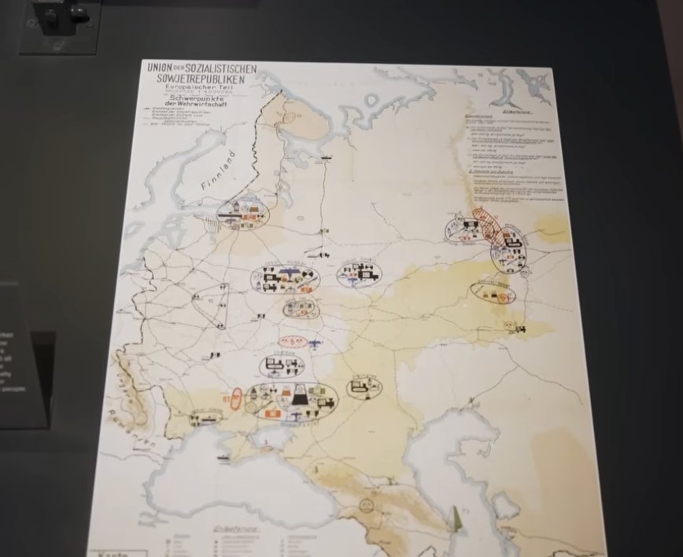

# barbarossa
2026.08.03

* [The Reason Operation Barbarossa Failed](https://youtu.be/pqZnuij5syE?t=283)


* https://claude.ai/chat/d5c1c123-16e6-4665-85b0-a07d3858eb1a
* https://chatgpt.com/c/6a715393-4fa4-83ea-85eb-8396ae0b6252


------------
------------
------------


The image appears to be a **German World War II-era strategic map of the European part of the Soviet Union**.

At the top left I can read:

> **UNION der SOZIALISTISCHEN SOWJETREPUBLIKEN**
> **Europäische Teile** ("European Part")
> **Schwerpunkte der Wehrwirtschaft** ("Centers/Focal Points of the War Economy")

That title strongly suggests this is **not a Soviet map**, but a **German military or economic intelligence map** showing the industrial and military-economic infrastructure of the western USSR.

The map likely depicts:

* Major industrial centers
* Arms factories
* Steel and coal production
* Oil facilities
* Aircraft, tank, and shipbuilding industries
* Railroads connecting those industries
* Important ports and transportation hubs

The circled symbols around cities such as:

* Leningrad (near Finland)
* Moscow
* Gorky (Nizhny Novgorod)
* Kharkiv
* Donbas
* Rostov
* Crimea

represent concentrations of different industries. The colored pictograms denote different sectors (steel, machinery, chemicals, aviation, shipbuilding, etc.), while the rail network shows how these centers were connected.

This type of map was commonly produced by:

* the **German Wehrmacht High Command (OKW/OKH)**,
* the **German General Staff**, or
* German economic intelligence agencies

before and during **Operation Barbarossa (1941)** to understand the Soviet Union's industrial capacity.

So, in short:

> **This is a German military intelligence map of the European USSR showing the distribution of Soviet war industry and strategic economic infrastructure.**

If you tell me **where you photographed it** (museum, archive, or exhibition), I may be able to identify the exact document and date.


------------
------------
------------


This is genuinely one of the most important and disturbing dimensions of Barbarossa — the plans went far beyond military conquest into large-scale demographic engineering and mass death. Here's what German planning actually called for:

## Generalplan Ost (General Plan East)

This was the master blueprint for the long-term colonization and ethnic reorganization of Eastern Europe and the western USSR, developed by the SS Reich Security Main Office (RSHA) alongside various planning offices.

- **Deportation and displacement**: The plan envisioned deporting the vast majority of the Slavic population (Russians, Ukrainians, Belarusians, Poles) further east, over a period of roughly 25–30 years, to make room for German settlers.
- **Estimated numbers**: Drafts of the plan discussed removing somewhere between **31 million and 45 million people** from the target territories, depending on the version of the plan and scope considered.
- **Germanization**: A small percentage of the population deemed "racially valuable" (often based on pseudo-scientific criteria) was to be Germanized and absorbed; the rest were to be pushed into Siberia, reduced to slave labor, or eliminated.
- **Settlement**: German farmers and colonists ("Wehrbauern," or soldier-farmers) were to be settled on the cleared land, organized around planned agricultural colonies and strongpoints.

## The Hunger Plan (Der Hungerplan)

Devised primarily by Herbert Backe (state secretary for food) and economic planners like the Wirtschaftsstab Ost — this ties directly back to the war-economy map you photographed.

- The core idea: the German army and home front would be fed by **stripping food from Soviet territory**, especially Ukraine's agricultural surplus, and redirecting it to Germany.
- Planners explicitly calculated that this would cause **mass starvation of tens of millions of Soviet civilians**, particularly in urban areas and the forest-zone north (Russia proper), which were considered "surplus population" that didn't need to be fed at all.
- Internal documents (from a May 1941 economic policy conference) stated plainly that "many tens of millions of people will be superfluous and must die or emigrate to Siberia."

## Treatment of Specific Groups

- **Jews**: Barbarossa was launched alongside the deployment of the **Einsatzgruppen** (mobile killing squads), which followed the advancing army and carried out mass shootings of Jewish communities — this predates and then feeds into the formalized Holocaust machinery (Wannsee Conference, Jan 1942).
- **Soviet POWs**: The infamous **Commissar Order** directed the summary execution of captured Soviet political officers. More broadly, of roughly 5.7 million Soviet POWs captured over the war, around **3.3 million died in German captivity**, largely through deliberate starvation and neglect — not incidental mistreatment, but a foreseeable and in many cases intended outcome of policy.
- **Urban populations**: Leningrad and Moscow were specifically slated not for capture-and-administration but for **destruction/starvation** — Hitler's directives called for Leningrad to be encircled and starved rather than occupied, its population left to die rather than be fed.

## How This Connects to Your Map

The Wehrwirtschaft map you found — cataloguing industrial capacity — sits right alongside this planning apparatus. The economic staff mapping factories and resources were part of the same bureaucratic machine calculating **how much food and industrial output could be extracted, and how many people that extraction would starve**. It wasn't a side effect; it was budgeted.

If you want, I can go deeper into any one thread — the Generalplan Ost's specific regional variants (there were several drafts, e.g., by Konrad Meyer), the Hunger Plan's internal memos, or how these plans shifted once the "quick war" assumption collapsed after Moscow.

---------------
---------------
---------------


# The Map and the Plan Behind It: A Combined Assessment

## What the Map Shows

The document is a German-produced intelligence/planning map titled **"Union der Sozialistischen Sowjetrepubliken, Europäischer Teil"** with the subtitle **"Schwerpunkte der Wehrwirtschaft"** ("Focal Points of the War Economy"). This is not a Soviet document — it's a product of German military-economic intelligence, almost certainly compiled by the Wehrmacht High Command (OKW/OKH), the General Staff, or affiliated economic planning offices (such as the *Wirtschaftsstab Ost*) in preparation for **Operation Barbarossa**.

The map catalogues Soviet industrial and military-economic infrastructure across European Russia, using clustered pictogram symbols to mark:

- Major industrial centers and arms factories
- Steel, coal, and chemical production
- Oil facilities and refineries
- Aircraft, tank, and shipbuilding capacity
- Rail networks linking these centers
- Key ports and transport hubs

The ovals cluster around recognizable strategic regions: **Leningrad** (northwest, near Finland), **Moscow** (political/transport hub), **Gorky/Nizhny Novgorod**, **Kharkiv**, the **Donbas** (the USSR's principal coal and heavy-industry basin), **Rostov**, and **Crimea**, with the route further south pointing toward the **Caucasus oil fields** — later the explicit target of the 1942 follow-up campaign, Operation Blue.

The map's core purpose: help planners answer *which regions to seize first, which cities held tank/aircraft/ammunition production, where the coal-iron-oil base sat, and which rail hubs and cities to prioritize for bombing or occupation.* This economic-intelligence function connects it directly to what German planners were simultaneously calculating about the population living on top of that infrastructure.

## The Underlying Assumption of Barbarossa

German planners believed that seizing these industrial and economic centers would collapse the Soviet capacity to wage war, combined with the belief that the Soviet state itself would crumble once its border armies were destroyed. This assumption proved only partially correct: thousands of Soviet factories were dismantled and evacuated east of the Urals ahead of the German advance, industry was reassembled and resumed production there, and the "quick war" turned into a prolonged war of attrition.

## What Germans Planned for the Soviet Population

Behind the economic-intelligence mapping sat a parallel, far darker planning apparatus for the people living in the territory being mapped. This wasn't incidental to the invasion — it was budgeted and calculated alongside the industrial targets.

### Generalplan Ost (General Plan East)

The SS Reich Security Main Office's master blueprint for the long-term colonization of the conquered east:

- **Mass deportation eastward**: The Slavic population (Russians, Ukrainians, Belarusians, Poles) was to be displaced further into Siberia over roughly 25–30 years to clear land for German settlers.
- **Estimated scope**: Drafts of the plan discussed removing somewhere between **31 million and 45 million people**, depending on the version and territorial scope considered.
- **Selective Germanization**: A small fraction deemed "racially valuable" would be absorbed into the German population; the rest faced displacement, enslavement, or death.
- German farmer-settlers (*Wehrbauern*) were to be resettled on the cleared land.

### The Hunger Plan (Der Hungerplan)

Devised largely by Herbert Backe and the same economic-planning apparatus responsible for maps like this one:

- The plan called for **diverting Soviet agricultural surplus (especially from Ukraine) to feed Germany**, while deliberately cutting off food to Soviet cities and the northern forest zone.
- Internal planning documents from May 1941 stated explicitly that this policy would cause **"tens of millions of people" to die or be forced to emigrate to Siberia** — this was a foreseen and accepted outcome, not an unintended side effect.
- **Leningrad** specifically was targeted for encirclement and starvation rather than capture — Hitler's directive called for the city to be sealed off and its population left to die.

### Treatment of Specific Groups

- **Jewish population**: The invasion was launched alongside the deployment of the **Einsatzgruppen**, mobile killing units that carried out mass shootings of Jewish communities in newly occupied territory — the operational precursor to the formalized Holocaust apparatus established at the Wannsee Conference in January 1942.
- **Soviet POWs**: The **Commissar Order** mandated summary execution of captured political officers. Of roughly **5.7 million Soviet POWs** captured over the war, approximately **3.3 million died in German captivity**, overwhelmingly through deliberate starvation and neglect.

## Combined Death Toll Under German Planning

Putting the pieces together, German planning documents — not later estimates by historians, but the Germans' own internal projections — anticipated civilian and POW deaths in the tens of millions if Barbarossa succeeded as planned:

| Category | Planned/Actual Scale |
|---|---|
| Population targeted for deportation (Generalplan Ost) | 31–45 million |
| Civilian starvation deaths anticipated (Hunger Plan) | "Tens of millions" (explicitly stated in planning documents) |
| Soviet POW deaths (actual, 1941–45) | ~3.3 million of 5.7 million captured |
| Jewish civilians killed by Einsatzgruppen (1941 onward) | In the hundreds of thousands within the first year alone, rising into the millions as the broader Holocaust unfolded |

Taken together, German planners were not simply pursuing military conquest — they were designing a program of engineered famine, mass deportation, and selective extermination intended to permanently depopulate and re-colonize the western Soviet Union. The war-economy map you photographed is a small but telling artifact of that same planning machine: an inventory of what the Germans intended to extract, sitting alongside a parallel ledger of how many people that extraction was expected to kill.


---------------
---------------
---------------


```
…or create a new repository on the command line
echo "# barbarossa" >> README.md
git init
git add README.md
git commit -m "first commit"
git branch -M main
git remote add origin https://github.com/ftk1000/barbarossa.git
git push -u origin main
…or push an existing repository from the command line
git remote add origin https://github.com/ftk1000/barbarossa.git
git branch -M main
git push -u origin main

```
